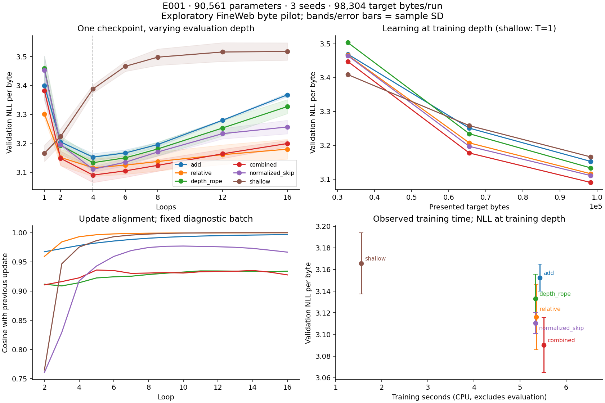

# E001: результаты собственного CPU-пилота

Статус: исследовательский pilot на FineWeb; не финальная оценка задания.

[Протокол до запуска](../research/protocols/E001_cpu_pilot.md) · [Регистрация и хеши](../runs/E001/registration.json) · [CSV всех seed и глубин](E001_depth_metrics.csv) · [Парные эффекты](E001_effects.json)

Выполнено 18 запусков, 1,769,472 предъявленных target-байтов суммарно. Во всех моделях 90,561 параметр; training T=4, кроме отдельно обученного shallow T=1. Сумма измеренного времени обучения: 85.6 s (без evaluation; это не GPU-прогноз).

Данные: 400 документов, split 322/45/33; validation — 64 документно чередуемых окна, 4096 целевых байтов. Test не использован. 98,304 target-байта на run, 3 seed, общий LR. Метрика NLL/byte; byte-PPL нельзя сравнивать с PPL BPE-моделей.

## Наблюдения

| Вариант | NLL@1, mean ± SD | NLL@4, mean ± SD | NLL@8, mean ± SD | Выигрыш 4→8, mean ± SD |
| --- | --- | --- | --- | --- |
| add | 3.3993 ± 0.0520 | 3.1524 ± 0.0124 | 3.1959 ± 0.0077 | -0.0434 ± 0.0050 |
| relative | 3.3013 ± 0.0153 | 3.1160 ± 0.0303 | 3.1373 ± 0.0326 | -0.0213 ± 0.0028 |
| depth_rope | 3.4588 ± 0.0420 | 3.1332 ± 0.0223 | 3.1806 ± 0.0237 | -0.0474 ± 0.0028 |
| combined | 3.3816 ± 0.0297 | 3.0902 ± 0.0254 | 3.1239 ± 0.0203 | -0.0337 ± 0.0057 |
| normalized_skip | 3.4530 ± 0.0486 | 3.1106 ± 0.0099 | 3.1702 ± 0.0141 | -0.0596 ± 0.0042 |
| shallow | 3.1657 ± 0.0283 | 3.3881 ± 0.0140 | 3.4980 ± 0.0282 | -0.1099 ± 0.0381 |

Положительный выигрыш 4→8 означает пользу дополнительных циклов у тех же весов; отрицательный — ухудшение. Shallow@4/@8 является экстраполяцией модели, обученной при T=1.

## Парные эффекты по seed

| Сравнение | Значения для seed 17 / 29 / 43 | Mean ± SD |
| --- | --- | --- |
| relative - add @4 | -0.06617 / -0.00721 / -0.03606 | -0.03648 ± 0.02948 |
| rotation - add @4 | -0.02473 / -0.02517 / -0.00780 | -0.01923 ± 0.00990 |
| combined - add @4 | -0.06671 / -0.07242 / -0.04756 | -0.06223 ± 0.01302 |
| factorial interaction @4 | +0.02418 / -0.04005 / -0.00371 | -0.00652 ± 0.03221 |
| normalized skip - relative @4 | +0.01878 / -0.01663 / -0.01829 | -0.00538 ± 0.02094 |
| relative vs add extrapolation gain | +0.02514 / +0.02373 / +0.01741 | +0.02209 ± 0.00411 |

Для строк NLL@4 отрицательный эффект означает снижение NLL; знак factorial interaction относится к взаимодействию компонентов. В последней строке положительное значение означает, что relative лучше additive сохраняет качество при 4→8. Это описательные оценки при n=3, не заявления о статистической значимости.

## Графики

## Ограничения

Серия короткая, контекст 64, byte vocabulary, небольшая удобная выборка и один LR. Близкие дубликаты не исключены полным промышленным pipeline. Seeds сравниваются на одних документах; ни глубины, ни документы не увеличивают число независимых обучений. Нормировка может менять эффективный LR; следующее сравнение должно это проверить.

Интерпретация гипотез и решение о следующем эксперименте записываются отдельно в журнале после анализа чисел; исходный протокол сохраняется неизменным.
