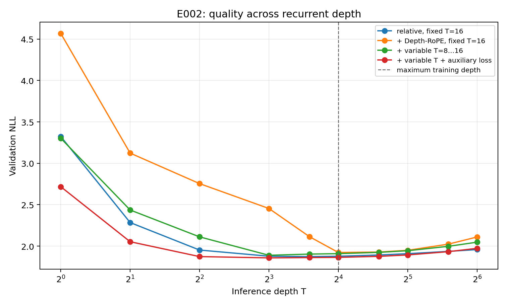

# E002 — GPU-screening механизмов глубины

**Статус:** завершён на NVIDIA GeForce RTX 4080 SUPER. Все четыре заранее зарегистрированные траектории дошли до 4,997,120 target-токенов; exit code 0, overflow и пропущенных optimizer steps нет. Test split не открывался.

## Результат

Depth-RoPE при фиксированной глубине не подтвердил первый прогноз: `combined_fixed16` хуже простого `relative_fixed16` на 0.0454 NLL при T=16 и на 0.0407 при T=32. Обучение на случайной глубине 8…16 устранило большую часть этого провала, а затухающий промежуточный loss дал лучший минимум серии. Однако auxiliary-вариант превосходит baseline лишь на 0.0137 NLL при T=16, а после T=48 кривые пересекаются. Дополнительные циклы после лучшей точки ухудшают NLL у всех четырёх моделей.

| Вариант | Время обучения | Лучший T | Лучший NLL | NLL@16 | Δ 16→32 | Δ 16→64 |
| --- | ---: | ---: | ---: | ---: | ---: | ---: |
| relative, fixed 16 | 115.9 с | 12 | 1.8733 | 1.8779 | +0.0308 | +0.0805 |
| + Depth-RoPE, fixed 16 | 138.6 с | 16 | 1.9233 | 1.9233 | +0.0262 | +0.1870 |
| + variable 8…16 | 104.5 с | 8 | 1.8892 | 1.9089 | +0.0355 | +0.1386 |
| + variable + auxiliary loss | 105.0 с | 8 | **1.8580** | **1.8642** | +0.0293 | +0.1092 |



Полные точки находятся в [`E002_depth_metrics.csv`](E002_gpu/E002_depth_metrics.csv). График использует логарифмическую ось глубины; пунктир отмечает максимальную тренировочную глубину T=16.

## Неопределённость

Для exploratory-оценки выполнен парный bootstrap по 45 validation-документам, 20,000 повторов. Разность считается как `candidate − relative_fixed16`, поэтому отрицательное число лучше baseline.

| Кандидат | T | Разность NLL | 95% bootstrap CI | P(candidate лучше) |
| --- | ---: | ---: | ---: | ---: |
| fixed Depth-RoPE | 16 | +0.0454 | [+0.0141, +0.0783] | 0.002 |
| variable 8…16 | 16 | +0.0311 | [+0.0046, +0.0593] | 0.011 |
| variable + auxiliary | 8 | −0.0203 | [−0.0402, −0.0006] | 0.978 |
| variable + auxiliary | 16 | −0.0137 | [−0.0386, +0.0109] | 0.867 |
| variable + auxiliary | 32 | −0.0153 | [−0.0459, +0.0145] | 0.840 |
| variable + auxiliary | 64 | +0.0150 | [−0.0255, +0.0522] | 0.223 |

Bootstrap по документам был выбран после запуска как описание неопределённости, а не как заранее зарегистрированный confirmatory test. Документов мало, окна внутри документа агрегированы, и один seed не измеряет вариативность обучения. Поэтому E002 не устанавливает победителя.

## Проверка исходных прогнозов

1. **Depth-RoPE сам по себе:** прогноз опровергнут в этой постановке. Несмотря на немного меньшую деградацию 16→32, абсолютный NLL хуже baseline, а деградация 16→64 намного больше.
2. **Variable-depth training:** относительно неудачного `combined_fixed16` он резко расширяет пригодную область глубин и улучшает NLL. Относительно `relative_fixed16` преимущества нет: при T=16 и T=32 он значимо хуже в парном bootstrap.
3. **Промежуточный loss:** улучшает весь поздний участок относительно `combined_random8_16`, но не превращает циклы после T=8 в полезное дополнительное вычисление. Это устойчивость к выбору глубины, а не test-time scaling.

## Решение

В BPE-подтверждение проходят `relative_fixed16` как сильный простой baseline и `combined_random8_16_aux` как единственный кандидат. Кандидат выбран не как установленный победитель, а потому что он создаёт различимую форму кривой: лучше на малой глубине и постепенно теряет преимущество при экстраполяции. Новый эксперимент должен проверить на общем 8k BPE tokenizer и новых seed, сохраняется ли этот компромисс.

`combined_fixed16` и `combined_random8_16` отсеиваются. Запускать их на полном бюджете нет основания.

## Воспроизводимость и ограничения

- Регистрация: SHA-256 `1467d598c67a2d3b31603856b6c37ff00b2eb09686393db1f68d0d66d83eb584`.
- Среда: Python 3.11.14, PyTorch 2.10.0+cu128, CUDA runtime 12.8.
- Модель: 5,377,281 параметр, byte vocabulary 256, context 64, batch 64, FP16.
- Wall-clock всей последовательной серии: 7 мин 46 с, включая evaluation и сохранение.
- Архивы и их контрольные суммы перечислены в [`SHA256SUMS`](E002_gpu/SHA256SUMS). Первый приём архива checkpoint был неполным и обнаружен сравнением SHA-256; итоговый файл перекачан и совпадает с сервером.
- Предупреждение PyTorch при логировании тензоров не влияло на optimizer или метрики; после завершения зарегистрированного запуска локальный код исправлен через `detach().item()`.
- Это screening на малом сохранённом FineWeb byte-snapshot. Он не заменяет постановку задания с 8k BPE, context 512, новыми seed и бюджетом до 100M токенов.

Анализ воспроизводится командой:

```bash
PYTHONPATH=.plot-deps MPLBACKEND=Agg MPLCONFIGDIR=/tmp/looped-mpl python3 scripts/analyze_e002.py
```
