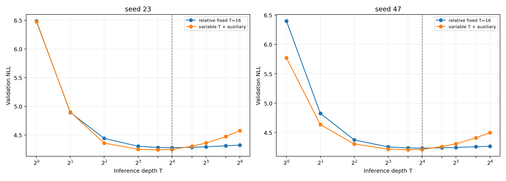

# E003 — подтверждение на FineWeb BPE8k

**Статус:** завершён на NVIDIA GeForce RTX 4080 SUPER. Два метода × два новых seed дошли до 24,969,216 target-токенов. Серия завершилась с exit code 0; non-finite loss, overflow и skipped optimizer updates не было. Test не использовался при выборе результата.

## Краткий вывод

Затухающий auxiliary loss с обучением на случайной глубине улучшает качество в области T=4…16 на обоих seed. При T=16 выигрыш относительно `relative_fixed16` равен 0.0292 и 0.0226 NLL. Но после T=16 candidate деградирует намного быстрее baseline: средняя `Δ NLL 16→32` равна +0.1032 против +0.0142.

Это воспроизводимый положительный результат по качеству внутри тренировочного диапазона и отрицательный результат по test-time scaling за его пределами. Зарегистрированное правило продолжения до 100M не выполнено на обоих seed, поэтому ни один метод не продолжается выборочно.

## LR-калибровка

До основного сравнения baseline с seed 101 получил одинаковые 4,980,736 токенов при двух LR. Расписание в обоих случаях было задано на 100M.

| Peak LR | NLL@16 | NLL@32 | Чистое время обучения |
| ---: | ---: | ---: | ---: |
| 0.001 | 5.3600 | 5.3820 | 175.8 с |
| **0.002** | **5.2498** | **5.2650** | 175.8 с |

Разница 0.1102 превышает зарегистрированный порог ничьей 0.02, поэтому LR 0.002 применён к обоим методам и обоим подтверждающим seed. Калибровка не считается подтверждением эффекта метода.

## Основное сравнение

| Метод | Seed | Лучший T | Лучший NLL | PPL | NLL@16 | NLL@32 | Δ 16→32 | Train time |
| --- | ---: | ---: | ---: | ---: | ---: | ---: | ---: | ---: |
| relative fixed 16 | 23 | 16 | 4.2773 | 72.04 | 4.2773 | 4.2937 | +0.0165 | 880.3 с |
| variable + auxiliary | 23 | 12 | **4.2412** | **69.49** | **4.2481** | 4.3591 | +0.1111 | 733.5 с |
| relative fixed 16 | 47 | 16 | 4.2340 | 69.00 | 4.2340 | 4.2459 | +0.0119 | 879.8 с |
| variable + auxiliary | 47 | 12 | **4.2058** | **67.07** | **4.2115** | 4.3068 | +0.0953 | 739.6 с |

Средний NLL candidate при T=12 равен 4.2235; лучший средний baseline при T=16 равен 4.2556. При общей основной глубине T=16 средняя разность `candidate − baseline` равна −0.0259 NLL. Кривые пересекаются между T=16 и T=24.

Полные точки: [`E003_depth_metrics.csv`](E003_bpe/E003_depth_metrics.csv). Машинное применение правила решения и bootstrap: [`E003_analysis.json`](E003_bpe/E003_analysis.json).

## Неопределённость и повторяемость

Парный bootstrap по 1,258 validation-документам, 20,000 повторов, условный на обученных checkpoints:

| Seed | T | candidate − baseline | 95% bootstrap CI |
| ---: | ---: | ---: | ---: |
| 23 | 16 | −0.0292 | [−0.0319, −0.0265] |
| 47 | 16 | −0.0226 | [−0.0250, −0.0201] |
| 23 | 32 | +0.0654 | [+0.0625, +0.0681] |
| 47 | 32 | +0.0609 | [+0.0579, +0.0638] |

Большая validation-выборка делает условную ошибку измерения небольшой, но bootstrap по документам не учитывает вариативность обучения. Для неё есть только два seed. Главное свидетельство повторяемости — одинаковый знак и близкий размер эффекта на seed 23 и 47.

## Проверка зарегистрированного решения

Для продолжения требовалось на **обоих** seed либо улучшить NLL@16 минимум на 0.02 без ухудшения `Δ16→32`, либо улучшить `Δ16→32` минимум на 0.02 при практически не худшем NLL@16.

| Seed | Выигрыш candidate по NLL@16 | Baseline Δ16→32 | Candidate Δ16→32 | Проходит? |
| ---: | ---: | ---: | ---: | --- |
| 23 | +0.0292 | +0.0165 | +0.1111 | Нет |
| 47 | +0.0226 | +0.0119 | +0.0953 | Нет |

Candidate проходит порог качества, но нарушает условие глубины. `continue_both_to_100m = false`. Запуск только candidate до 100M после просмотра этого результата создал бы несимметричное сравнение и противоречил протоколу.

## Интерпретация

В E002 auxiliary recipe мог выглядеть как общее расширение плато. E003 различает более точную картину: промежуточная супервизия помогает readout уже на T=4…16, но не учит recurrence продолжать полезное вычисление после максимальной тренировочной глубины. Более того, кандидат хуже baseline начиная с T=24.

Улучшение NLL не объясняется большим training compute: candidate использует T равномерно от 8 до 16 и обучается примерно на 16% быстрее fixed-T16 baseline. Цена — больший peak allocated memory, 6.99 ГБ против 5.27 ГБ, потому что auxiliary readout хранит траекторию состояний.

Наиболее осторожная формулировка результата: **anytime supervision улучшает качество в пределах обучаемого диапазона глубин, а relative fixed-depth recurrence лучше переносится за этот диапазон; ни один вариант не превращает T>16 в полезный test-time scaling.**

## Выбор перед закрытым test

До просмотра test зафиксирован `combined_random8_16_aux`, seed 47, checkpoint SHA-256 `c5fac83cc147c5abd91e49b818620f3162cd7d38a69ae35eb79eeb06ad02f146`, inference depth T=12. Этот depth минимален у candidate на обоих seed, а seed 47 имеет меньший validation NLL среди двух candidate-checkpoints. Для контроля на тех же test-окнах выбран `relative_fixed16`, seed 47, SHA-256 `446d610faef460904909cf19989843ad9e38904b57e08312dbb4982ce5687bc9`, при T=16.

[E004](E004_report.md) затем выполнен один раз: candidate получил test NLL 4.2103 / PPL 67.38 при T=12. При общей T=16 candidate улучшил test NLL на 0.0253 относительно baseline, что близко к validation-разности 0.0226. После test модель и depth не менялись.

## Стоимость и воспроизводимость

- Модель: 9,440,513 уникальных параметров, vocabulary 8192, context 512.
- Данные: [FineWeb BPE8k data card](../research/DATA_BPE8K.md); train-окна не повторяются.
- Основная серия: 99,876,864 предъявленных токена суммарно по четырём траекториям; ограничение 100M соблюдено для каждой.
- Чистое training time: 3,233.2 с суммарно; wall-clock последовательной серии вместе с eval и запуском — 55 мин 46 с.
- Final eval каждой модели: около 27–29 с на 1,048,576 токенах и глубинах до T=64.
- Архивы результатов/checkpoints проверены против серверных SHA-256; контрольные суммы — в [`SHA256SUMS`](E003_bpe/SHA256SUMS).

Поле `training_seconds` верхнего уровня в зарегистрированном result JSON включает финальный eval из-за места измерения таймера. Чистое training time берётся из последней строки `learning_curve.jsonl`; `evaluation.seconds` хранится отдельно. Ошибка касается подписи времени, не весов, optimizer или NLL. Зарегистрированный runner не менялся внутри серии.

Ограничения: один закреплённый FineWeb shard, два подтверждающих seed, только 25M токенов на checkpoint и одна архитектура 9.44M. Вывод об отсутствии полезной экстраполяции относится к проверенным механизмам и диапазону, а не ко всем looped Transformers.
