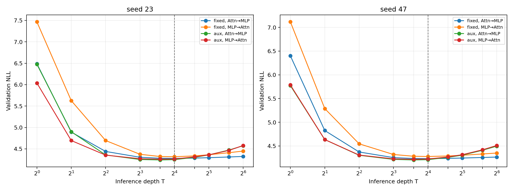

# E005: порядок MLP→Attention

Дата публикационного среза: 23 августа 2026 года.

## Вопрос и дизайн

Проверялось, улучшает ли перестановка residual sublayers с `Attention→MLP` на `MLP→Attention` качество looped Transformer и совместима ли она с random-depth training и затухающим auxiliary LM loss.

Сравнение выполнено при неизменных данных, tokenizer, архитектурном размере, optimizer, LR schedule, token budget и validation documents. Для каждого нового режима использованы seed 23 и 47, по 24,969,216 предъявленных токенов. Модель содержит 9,440,513 уникальных параметров. Условия H1/H2 были записаны до запуска в [протоколе](../research/protocols/E005_order_interaction.md).

## Результаты

| Recipe | Seed | Порядок | Лучший T | Лучший NLL | NLL@16 | NLL@32 |
| --- | ---: | --- | ---: | ---: | ---: | ---: |
| fixed T=16 | 23 | Attention→MLP | 16 | **4.2773** | **4.2773** | **4.2937** |
| fixed T=16 | 23 | MLP→Attention | 16 | 4.3157 | 4.3157 | 4.3622 |
| fixed T=16 | 47 | Attention→MLP | 16 | **4.2340** | **4.2340** | **4.2459** |
| fixed T=16 | 47 | MLP→Attention | 16 | 4.2785 | 4.2785 | 4.3047 |
| random T=8…16 + auxiliary | 23 | Attention→MLP | 12 | **4.2412** | **4.2481** | 4.3591 |
| random T=8…16 + auxiliary | 23 | MLP→Attention | 12 | 4.2585 | 4.2623 | **4.3607** |
| random T=8…16 + auxiliary | 47 | Attention→MLP | 12 | **4.2058** | **4.2115** | **4.3068** |
| random T=8…16 + auxiliary | 47 | MLP→Attention | 12 | 4.2179 | 4.2248 | **4.3163** |

При fixed-depth перестановка ухудшила NLL@16 на `0.0384` и `0.0444`. В auxiliary-рецепте ухудшение составило `0.0143` и `0.0133`. Во всех четырёх сравнениях paired document bootstrap даёт 95% CI выше нуля для разности `MLP-first − standard`:

| Recipe | Seed | ΔNLL@16 | 95% CI |
| --- | ---: | ---: | --- |
| fixed | 23 | +0.0384 | [0.0360; 0.0409] |
| fixed | 47 | +0.0444 | [0.0419; 0.0470] |
| auxiliary | 23 | +0.0143 | [0.0121; 0.0165] |
| auxiliary | 47 | +0.0133 | [0.0114; 0.0151] |

Полные точки находятся в [`E005_depth_metrics.csv`](E005/E005_depth_metrics.csv), bootstrap и машинное применение правила решения — в [`E005_analysis.json`](E005/E005_analysis.json).

## Проверка гипотез

- **H1 опровергнута:** MLP-first не улучшил fixed-depth control минимум на 0.02; знак эффекта отрицательный на обоих seed.
- **H2 опровергнута:** MLP-first не улучшил auxiliary recipe при T=12 или T=16. Условие по деградации `16→32` прошло, но обязательный порог качества не выполнен.
- Средняя разность разностей при T=16 равна `−0.0276 NLL`. Auxiliary training уменьшает вред перестановки относительно fixed-depth режима, но не превращает её в улучшение.

## Стоимость и целостность

Четыре обучения заняли суммарно 55.8 минуты чистого GPU training time. Peak allocated memory составил 4.91 GiB для fixed-depth и 6.51 GiB для random-depth режима; пропущенных optimizer updates не было.

SHA-256 локально проверенного архива результатов и сохранённого на сервере архива checkpoints записаны в [`SHA256SUMS`](E005/SHA256SUMS). Параметры каждого запуска и индивидуальные hashes результатов, регистраций и checkpoints находятся в [`E005_run_manifest.json`](E005/E005_run_manifest.json). Сырые результаты и веса исключены из Git из-за размера.

## Вывод

Постоянный порядок `MLP→Attention` не подходит как улучшение этой постановки. Он ухудшает абсолютное качество и, в fixed-depth режиме, сильнее портит поведение после обучаемой глубины. Основной результат E003/E004 остаётся выбранной конфигурацией: `Attention→MLP`, random depth 8…16 и затухающий auxiliary loss.

Вывод ограничен одной архитектурой 9.44M, одним закреплённым FineWeb shard, двумя seed и бюджетом около 25M токенов на модель.
