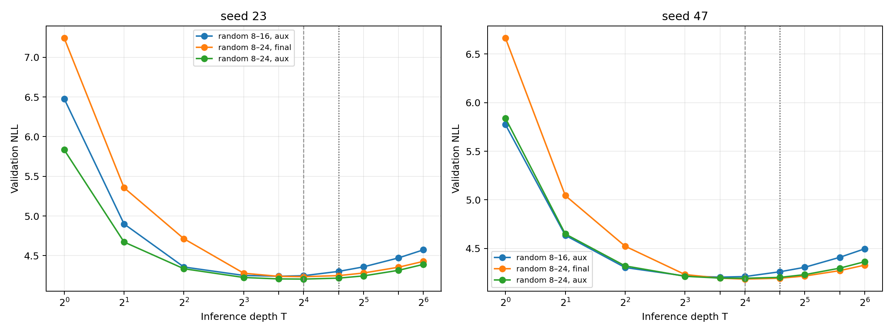

# E006: сдвиг диапазона обучающих глубин

Дата публикационного среза: 23 августа 2026 года.

## Вопрос и контроль вычислений

E006 проверяет, является ли деградация после `T=16` жёстким свойством архитектуры или следует за верхней границей обучающих глубин. Диапазон random-depth расширен с `8…16` до `8…24`. Его средняя глубина равна 16, поэтому ожидаемое число применений core совпадает с fixed-T=16 control.

Обучены final-only и auxiliary варианты на seed 23/47. Данные, tokenizer, модель 9,440,513 параметров, optimizer, LR schedule, token budget 24,969,216 и validation documents совпадают с E003. Закрытый test E004 повторно не использовался. Пороги H1/H2/H3 записаны до запуска в [протоколе](../research/protocols/E006_depth_range.md).

## Результаты

| Recipe | Seed | Лучший T | Лучший NLL | NLL@16 | NLL@24 | NLL@32 |
| --- | ---: | ---: | ---: | ---: | ---: | ---: |
| random 8…16 + auxiliary | 23 | 12 | 4.2412 | 4.2481 | 4.3021 | 4.3591 |
| random 8…24, final-only | 23 | 16 | 4.2357 | 4.2357 | 4.2490 | 4.2818 |
| random 8…24 + auxiliary | 23 | 16 | **4.2055** | **4.2055** | **4.2174** | **4.2452** |
| random 8…16 + auxiliary | 47 | 12 | 4.2058 | 4.2115 | 4.2608 | 4.3068 |
| random 8…24, final-only | 47 | 16 | **4.1858** | **4.1858** | **4.1944** | **4.2170** |
| random 8…24 + auxiliary | 47 | 16 | 4.1939 | 4.1939 | 4.2032 | 4.2312 |

Расширение support сдвинуло лучший readout с T=12 на T=16 у обоих seed. Для auxiliary-варианта деградация `16→24` уменьшилась:

- seed 23: `0.0541 → 0.0119 NLL`;
- seed 47: `0.0493 → 0.0093 NLL`.

По сравнению с прежним random8…16 auxiliary control новый auxiliary-вариант улучшил NLL@24 на `0.0847` и `0.0576`. Paired document bootstrap даёт 95% CI `[-0.0881; -0.0815]` и `[-0.0600; -0.0551]`, то есть эффект на закреплённых validation documents однозначный для обоих seed.

## Auxiliary loss

При одинаковом диапазоне 8…24 эффект auxiliary loss не воспроизвёлся между training seed:

- seed 23: улучшение относительно final-only на `0.0303 NLL` при T=16;
- seed 47: ухудшение на `0.0081 NLL`.

Оба paired bootstrap CI исключают ноль, но имеют противоположные знаки. Это не шум evaluation: наблюдается взаимодействие auxiliary loss с траекторией обучения. Среднее двух seed в пользу auxiliary недостаточно для выбора метода без дополнительных seed.

## Решение по протоколу

- **H1 — false:** требуемое уменьшение деградации достигнуто на обоих seed, но абсолютный порог `NLL@24−NLL@16≤0.01` нарушен на seed 23 (`0.0119`). Результат близок к порогу, поэтому отдельно показываются величина эффекта и формальное решение.
- **H2 — false:** auxiliary loss не улучшает final-only на обоих seed.
- **H3 — false:** `NLL@32−NLL@24` равно `0.0278` и `0.0280`, выше порога 0.02.

Полные точки находятся в [`E006_depth_metrics.csv`](E006/E006_depth_metrics.csv), bootstrap и применение правил — в [`E006_analysis.json`](E006/E006_analysis.json), параметры и hashes запусков — в [`E006_run_manifest.json`](E006/E006_run_manifest.json).

## Стоимость и целостность

Четыре обучения заняли 65.1 минуты чистого GPU training time. Peak allocated memory составил 5.41 GiB для final-only и 7.01 GiB для auxiliary; пропущенных optimizer updates не было. Контрольные суммы архива результатов и сохранённого на сервере архива checkpoints находятся в [`SHA256SUMS`](E006/SHA256SUMS). Сырые данные и веса исключены из Git из-за размера.

## Вывод

Рабочая глубина частично следует за распределением train-time depths: расширение диапазона переносит минимум и резко улучшает качество около новой границы. Однако после T=24 деградация возникает снова. Следовательно, random-depth support управляет положением рабочей области, но сам по себе не создаёт неограниченное test-time scaling.

E006 является post-test validation ablation и не заменяет заранее выбранный checkpoint E004 без новой закрытой оценки.
