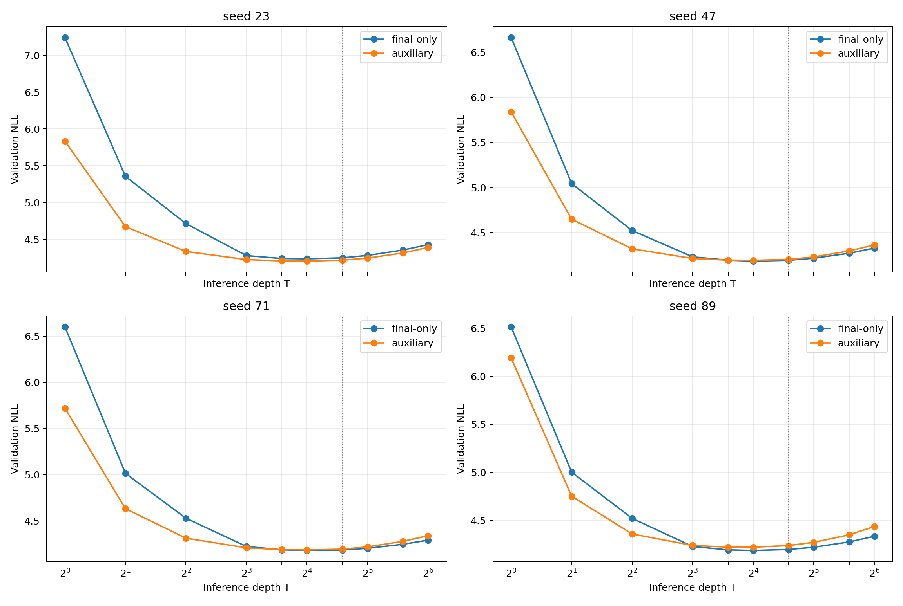

# E007: репликация на новых training seed

Дата публикационного среза: 23 августа 2026 года.

## Вопрос

E006 показал противоположный эффект auxiliary loss на seed 23 и 47. E007 повторяет final-only/auxiliary сравнение для random-depth 8…24 на заранее выбранных seed 71 и 89. Метод, данные, architecture, token budget и validation не меняются. Условия R1/R2/R3 записаны до запуска в [протоколе](../research/protocols/E007_seed_replication.md).

## Новые результаты

| Seed | Режим | Лучший T | Лучший NLL | NLL@16 | NLL@24 | NLL@32 |
| ---: | --- | ---: | ---: | ---: | ---: | ---: |
| 71 | final-only | 16 | **4.1799** | **4.1799** | **4.1854** | **4.2037** |
| 71 | auxiliary | 16 | 4.1864 | 4.1864 | 4.1948 | 4.2190 |
| 89 | final-only | 16 | **4.1879** | **4.1879** | **4.1987** | **4.2217** |
| 89 | auxiliary | 16 | 4.2221 | 4.2221 | 4.2397 | 4.2723 |

На seed 71 auxiliary ухудшил NLL на `0.0065` при T=16 и `0.0094` при T=24. На seed 89 ухудшение составило `0.0342` и `0.0410`. Paired document bootstrap подтверждает знак:

| Seed | T | ΔNLL auxiliary−final | 95% CI |
| ---: | ---: | ---: | --- |
| 71 | 16 | +0.0065 | [0.0048; 0.0083] |
| 71 | 24 | +0.0094 | [0.0076; 0.0111] |
| 89 | 16 | +0.0342 | [0.0318; 0.0366] |
| 89 | 24 | +0.0410 | [0.0385; 0.0436] |

## Все четыре seed

| Seed | final−aux NLL@16 | final−aux NLL@24 | Победитель |
| ---: | ---: | ---: | --- |
| 23 | +0.0303 | +0.0316 | auxiliary |
| 47 | −0.0081 | −0.0089 | final-only |
| 71 | −0.0065 | −0.0094 | final-only |
| 89 | −0.0342 | −0.0410 | final-only |
| Среднее | −0.0046 | −0.0069 | final-only |

Auxiliary loss выиграл только на одном из четырёх seed. Средний эффект мал по сравнению с разбросом между траекториями, но знак и простота модели поддерживают final-only как более устойчивый режим.

## Решение по протоколу

- **R1 — false:** auxiliary не улучшил качество на обоих новых seed.
- **R2 — true:** для обоих режимов и обоих новых seed лучший readout находится при T=16, а `NLL@24−NLL@16≤0.02`.
- **R3 — false:** auxiliary выигрывает минимум на 0.01 только на одном из четырёх seed; средний эффект отрицателен.

Полные точки находятся в [`E007_depth_metrics.csv`](E007/E007_depth_metrics.csv), bootstrap и решения — в [`E007_analysis.json`](E007/E007_analysis.json), параметры и hashes запусков — в [`E007_run_manifest.json`](E007/E007_run_manifest.json).

## Стоимость и целостность

Четыре новых обучения заняли 63.8 минуты чистого GPU training time. Peak allocated memory составил 5.41 GiB для final-only и 7.01 GiB для auxiliary; пропущенных optimizer updates не было. SHA-256 всех checkpoints совпадает с result JSON. Контрольные суммы транспортных архивов находятся в [`SHA256SUMS`](E007/SHA256SUMS).

## Вывод

Промежуточный LM loss не является устойчивым улучшением при расширенном диапазоне 8…24. Более простой final-only режим выигрывает на трёх из четырёх seed и сохраняет стабильную кривую в обучаемом диапазоне. Это мотивирует заранее зарегистрированную новую закрытую оценку final-only при T=16, но не меняет старый test E004 задним числом.
